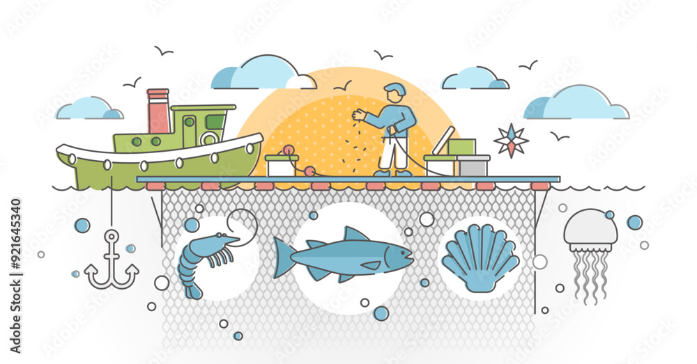

# Ocean Superfarms: Finding the Best Spots to Grow Seafood

## Description

## Repository Structure

This repository contains:

## Data Description & Access

## Authors & Additional Contributions

This repository is maintained by Vedika Shirtekar as part of the Master of Environmental Data Science program at the University of California, Santa Barbara. Thank you to The Bren School of Environmental Science and Management for facilitating data access and documentation.

## References
